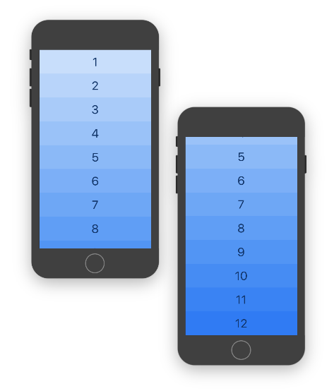
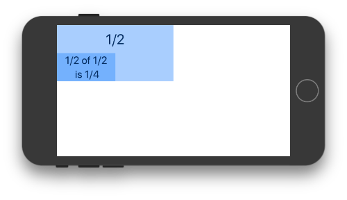

# React Native Responsive Layout (RNRL)
[](https://www.npmjs.com/package/react-native-responsive-layout)
[](https://circleci.com/gh/axilis/react-native-responsive-layout)
[](https://david-dm.org/axilis/react-native-responsive-layout)

A framework that makes building responsive React Native user interfaces easier by bringing over concepts from web development.

## Installation

This package is only **compatible with RN >= 0.42** since older versions do not support percentage-based widths. 
To install the latest version simply run:

```bash
yarn add react-native-responsive-layout
```
alternatively, if you prefer using `npm`:
```bash
npm install --save react-native-responsive-layout
```

## Motivation

Even though React Native offers a faster way to build complex native applications, creating responsive RN UIs is significantly more difficult than compared to web development. This difficulty was somewhat mitigated when percentage-based widths landed. However, responsive RN UIs still require the use of many conditional renderings and size-specific overrides. RNRL brings over the good parts from web development in order to simplify native development.

RNRL offers the ability to specify **different element sizes and styles or even swap entire components depending on target size**. This makes responsive UI development for RN as simple as using Bootstrap's grid system.

### Size Classes

Based on popular screen sizes, target sizes are as follows:

| Prefix | Breakpoint | Example Devices                     |
|--------|------------|-------------------------------------|
| xs     | <= 410 pt  | phones                              |
| sm     | >= 411 pt  | large phones                        |
| md     | >= 568 pt  | phones - landscape                  |
| lg     | >= 768 pt  | tablets                             |
| xl     | >= 1024 pt | tablets - landscape, large tablets  |
| xxl    | >= 1280 pt | large tablets - landscape           |

RNRL is **mobile first**. Therefore you start with the design for the smallest target size, and move up from there. Elements use size/style for the largest target size they fit. If a specific target size is not defined, the size will default to the next smaller defined size. This means if you define only `xsSize` and `lgSize`, all sizes smaller than `lgSize` use the value provided for `xsSize`, and the value of `lgSize` on the rest. 

When an element has the same behavior on all target sizes, you can use an un-prefixed version (e.g. `size`). Un-prefixed is just an alias for the smallest size, that makes reading code semantically clearer.

You can override breakpoint values on a specific grid instance by setting the `breakpoints` property.

## Examples

### Responsive Elements

Any `Block` element that defines multiple different size classes is responsive and adapts its size.

This [example](examples/1-responsive-elements.js) shows how to build a one-column design for smaller phones and a two-column design for larger devices. You can either use `xsSize` or `size` to set the base size, and then override it as needed. Blocks automatically fill the line and wrap onto a new line. However, you can also create a manual break by wrapping elements into another section.

```jsx
<Grid>
  <Section> {/* Light blue */}
    <Block xsSize="1/1" smSize="1/2" />
    <Block xsSize="1/1" smSize="1/2" />
    <Block xsSize="1/1" smSize="1/2" /> 
  </Section>
  <Section> {/* Dark blue */}
    <Block size="1/1" smSize="1/2" />
    <Block size="1/1" smSize="1/2" />
    <Block size="1/1" smSize="1/2" />
    <Block size="1/1" smSize="1/2" />
    <Block size="1/1" smSize="1/2" />
  </Section>
</Grid>
```


### Selectively Displaying Elements

Using `*hidden` and `*visible` properties is the easiest way to display element only on specific target sizes.

This [example](examples/2-hidden-elements.js) shows how to use `smHidden` property to display the second block only on smaller phones. The third block is exactly the opposite, it is hidden by default using `hidden`, and only visible on larger devices because it was overridden with `smVisible`.

```jsx
<Grid>
  <Section>
    <Block />                  {/* default -- always visible */}
    <Block smHidden />         {/* small phones only (xs), hidden on larger */}
    <Block hidden smVisible /> {/* only large phones and up (>= sm) */}
  </Section>
</Grid>
```


### Aligning and Shifting Elements

Rather than manually calculating filler element sizes for different target sizes, stretching elements can be used to align elements more easily.

This [example](examples/3-shifting-elements.js) shows how to align elements. To **left** align an element and keep the remaining space free, add the next element to a new section. To **center** align an element, add a stretching element both before and after the element. To **right** align it, add a single stretching element before.

Main benefit of this approach, compared to setting flex attributes on parent element is that it is simple to override how elements are rendered on different target sizes.

Stretched elements automatically span at least one grid unit (`1/12`) to avoid having a width of zero. Since elements wrap once entire space is filled, when aligning elements to the right you will want to put them into same section.

```jsx
<Grid>
  <Section>
    <Block xsSize="1/2" smSize="1/4" /> {/* Left */}
  </Section>
  <Section>
    <Block size="stretch" />
    <Block xsSize="1/2" smSize="1/4"></Block> {/* Center */}
    <Block size="stretch" />
  </Section>
  <Section>
    <Block size="stretch" />
    <Block xsSize="1/2" smSize="1/4"></Block> {/* Right */}
  </Section>
  <Section>
    <Block xsSize="1/3" smSize="1/4"></Block> {/* Left */}
    <Block size="stretch" />
    <Block xsSize="1/3" smSize="1/4"></Block> {/* Right */}
  </Section>
</Grid>
```


### Combining Fixed and Responsive Widths

This [example](examples/4-fixed-size-elements.js) shows how to fill the remaining space after fixed sized elements and how it is possible to combine different units for blocks inside same section.

```jsx
<Grid>
  <Section>
    <Block size={100} />      {/* 100pt */}
    <Block size="stretch" />  {/* stretch */}
    <Block size="1/4" />      {/* 1/4 */}
    <Block size="25%" />      {/* 25% */}
  </Section>
  <Section>
    <Block size={150} />      {/* fixed */}
    <Block size="stretch" />  {/* remaining width */}
  </Section>
</Grid>
```


### Conditionally Rendering Styles/Components

To enable changing other properties, such as styles you can wrap your component with [`withSizeClass`](docs/api/README.md#withsizeclasscomponent). It provides a `sizeSelector` function that makes it easy to select a value depending on current target size.

This [example](examples/5-conditional-styling.js) shows how to render a component with a different style depending on target size. However, `sizeSelector` is not limited to just styles, its values can be any object. Therefore you can even render a completely different component.

```jsx
const WrappedComponent = withSizeClass(({ sizeSelector }) => {
  const style = sizeSelector({
    xs: styles.lightBackground,
    sm: styles.darkBackground,
  });

  return (
    <View style={style} />
  );
});
```

Wrapped component must be rendered inside the grid in order for selector functions to work.

```jsx
<Grid>
  <Section>
    <Block>
      <WrappedComponent />
    </Block>
  </Section>
</Grid>
```


### Changing the Orientation

Just like with `ScrollView` it is possible to set the horizontal property to change content orientation. 

This [example](examples/6-horizontal-direction.js) shows how to lay out grid horizontally. Height is the limiting dimension with a horizontal flow, so target size is determined by comparing breakpoints to it.


```jsx
<Grid horizontal>
  <Section>
    <Block xsSize="1/1" smSize="1/2" /> {/* 2018. */}
    <Block xsSize="1/1" smSize="1/2" /> {/* 2017. */}
    <Block xsSize="1/1" smSize="1/2" /> {/* 2016. */}
    <Block xsSize="1/1" smSize="1/2" /> {/* 2015. */}
    <Block xsSize="1/1" smSize="1/2" /> {/* 2014. */}
  </Section>
</Grid>
```


### Stretching the Grid

By default, the grid will take up as much space as its content requires. In order to stretch a grid across all the available space, simply set the grid’s `stretchable` property and add `stretch` to the desired sections. 

For a demonstration, take a look at the source of these [normal](examples/7-stretch-disabled.js) and [stretching](examples/7-stretch-enabled.js) examples. 

```jsx
<Grid stretchable>
  {/* This ensures grid itself spans available space. */}

  <Section>
    <Block>
      <View style={{ height: 80 }} />
    </Block>
  </Section>
  <Section stretch>
    {/* By default Sections are not stretched. */}
    <Block size="1/4" />  {/* L */}
    <Block size="stretch" /> {/* Content */}
  </Section>
  <Section>
    <Block>
      <View style={{ height: 80 }} />
    </Block>
  </Section>
</Grid>
```


### Scrollable Grid

When grid contains too many elements and would not fit on a screen, rather than wrapping it inside `ScrollView`, simply set the `scrollable` property. Main advantage of this approach is that it takes in count other grid settings such as orientation and stretching and configures the `ScrollView` for you. 

This [example](examples/8-scrollable-grid.js) shows just how easy is to add scroll functionality by just providing scrollable property.

If you require more control over `ScrollView`, you can always wrap the grid manually, without using `scrollable` prop. When wrapping stretching grid inside `ScrollView`, you should set `contentContainerStyle` prop to `{ flexGrow: 1 }` to ensure it stretches properly.

```jsx
<Grid scrollable>
  <Section>
    <Block xsSize="1/1" mdSize="1/2" /> {/* 1 */}
    {/* ... */}
    <Block xsSize="1/1" mdSize="1/2" /> {/* 12 */}
  </Section>
</Grid>
```



### Nested Grid

When nesting grid, block sizes will be based on space inside which it is placed. 

This [example](examples/9-nested-grid.js) shows how nesting works. When placing a grid inside a half-width block, the maximum width will be based on that space. That means that nested block with half-width will be rendered as fourth-width.

```jsx
<Grid>
  <Section>
    <Block size="1/2"> { /* Light blue */}
      <Text>1/2</Text>

      <Grid>
        <Section>
          <Block size="1/2"> { /* Dark blue */}
            <Text>1/2 of 1/2 is 1/4</Text>
          </Block>
        </Section>
      </Grid>

    </Block>
  </Section>
</Grid>
```




## Further Reading

For more information, take a look at [API docs](docs/api/).
